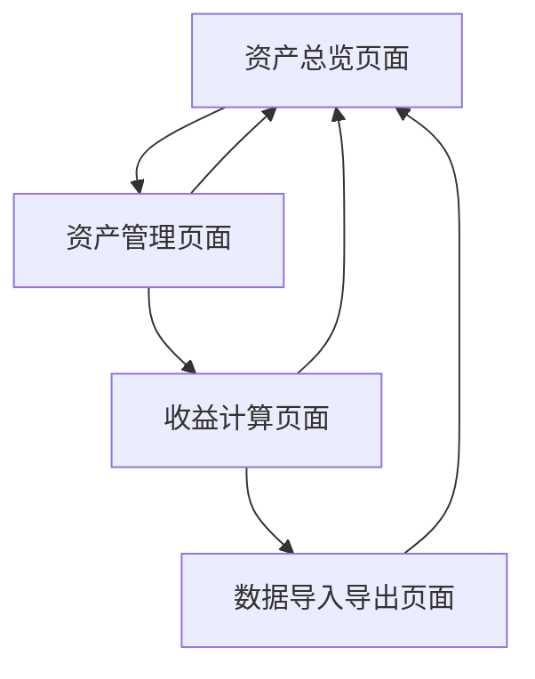

# 财富管理工具产品需求文档

## 1. 产品概述

本产品是一个可外部访问的移动端财富管理工具，部署在GitHub Pages上，帮助用户系统性地记录和管理各类资产，并通过自动化的利率计算功能实时跟踪资产价值变化。

产品旨在为用户提供一个简单易用的共享资产管理平台，所有用户可以查看和编辑同一套数据，解决手动记录繁琐、收益计算复杂的问题，实现协作式的财务管理。

## 2. 核心功能

### 2.1 用户角色

| 角色 | 访问方式 | 核心权限 |
|------|----------|----------|
| 共享用户 | 网页直接访问 | 可以查看、添加、编辑、删除共享资产记录，查看收益报表 |

### 2.2 功能模块

本财富管理工具需求包含以下主要页面：

1. **资产总览页面**：资产汇总展示、总资产价值、收益统计图表
2. **资产管理页面**：资产列表、添加/编辑/删除资产、资产分类管理
3. **收益计算页面**：利率设置、自动计算收益、历史收益记录
4. **数据导入导出页面**：批量导入资产数据、导出报表功能

### 2.3 页面详情

| 页面名称 | 模块名称 | 功能描述 |
|----------|----------|----------|
| 资产总览页面 | 资产汇总展示 | 显示所有资产的当前总价值、分类占比饼图、近期收益趋势图 |
| 资产总览页面 | 收益统计图表 | 展示月度、季度、年度收益变化曲线，支持时间范围筛选 |
| 资产管理页面 | 资产列表 | 显示所有资产记录，包含资产名称、类型、初始金额、当前价值、收益率 |
| 资产管理页面 | 添加/编辑资产 | 支持添加新资产记录，编辑现有资产信息，包括名称、类型、金额、利率、投入日期 |
| 资产管理页面 | 资产分类管理 | 创建和管理资产分类（如股票、基金、定期存款、理财产品等） |
| 收益计算页面 | 利率设置 | 为不同资产设置年化收益率，支持固定利率和浮动利率 |
| 收益计算页面 | 自动计算收益 | 根据设置的利率和时间自动计算资产当前价值和累计收益 |
| 收益计算页面 | 历史收益记录 | 记录和展示每次收益更新的历史数据，支持按时间查询 |
| 数据导入导出页面 | 批量导入功能 | 支持Excel/CSV格式批量导入资产数据 |
| 数据导入导出页面 | 导出报表功能 | 导出资产清单、收益报表为Excel/PDF格式 |

## 3. 核心流程

用户首先进入资产总览页面查看整体财务状况，然后通过资产管理页面添加或编辑具体的资产信息。在收益计算页面设置各资产的利率参数，系统会自动计算并更新资产价值。用户可以通过数据导入导出页面进行批量操作和报表生成。

## 4. 用户界面设计

### 4.1 设计风格

- **主色调**：深蓝色(#1e3a8a)作为主色，浅蓝色(#3b82f6)作为辅助色
- **按钮样式**：圆角矩形按钮，带有轻微阴影效果
- **字体**：主要使用微软雅黑，标题16px，正文14px，小字12px
- **布局风格**：卡片式布局，顶部导航栏，左侧边栏菜单
- **图标风格**：使用简洁的线性图标，配合💰💎📊等财务相关emoji

### 4.2 页面设计概览

| 页面名称 | 模块名称 | UI元素 |
|----------|----------|--------|
| 资产总览页面 | 资产汇总展示 | 大数字显示总资产，卡片式分类展示，使用渐变背景色，圆形进度条显示收益率 |
| 资产总览页面 | 收益统计图表 | 折线图和柱状图组合，使用Chart.js库，支持悬停交互效果 |
| 资产管理页面 | 资产列表 | 表格布局，斑马纹行，操作按钮使用图标+文字，支持排序和筛选 |
| 资产管理页面 | 添加/编辑资产 | 模态框弹窗，表单布局，输入框带有验证提示，日期选择器组件 |
| 收益计算页面 | 利率设置 | 滑块组件设置利率，实时预览计算结果，使用绿色表示正收益 |
| 数据导入导出页面 | 导入导出功能 | 拖拽上传区域，进度条显示处理状态，下载按钮带有文件格式图标 |

### 4.3 响应式设计

产品采用移动端优先的设计策略，专为手机浏览器优化。使用响应式布局确保在各种移动设备上都有良好的用户体验，支持触摸操作，图表和表格会自动适应屏幕尺寸。

### 4.4 部署方案

- **部署平台**：GitHub Pages
- **技术栈**：纯前端技术（HTML/CSS/JavaScript）
- **数据存储**：使用localStorage或GitHub API进行数据持久化
- **访问方式**：通过GitHub Pages提供的URL直接访问
- **数据同步**：所有用户访问同一套共享数据，实时更新